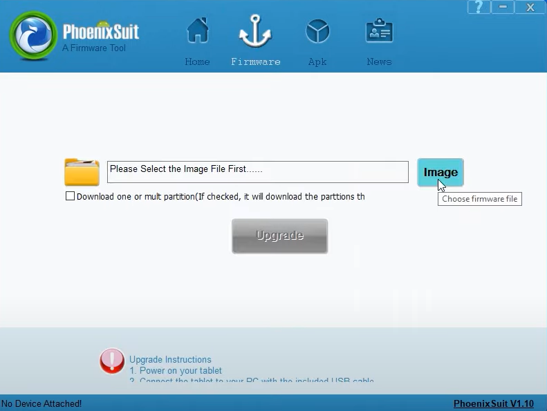
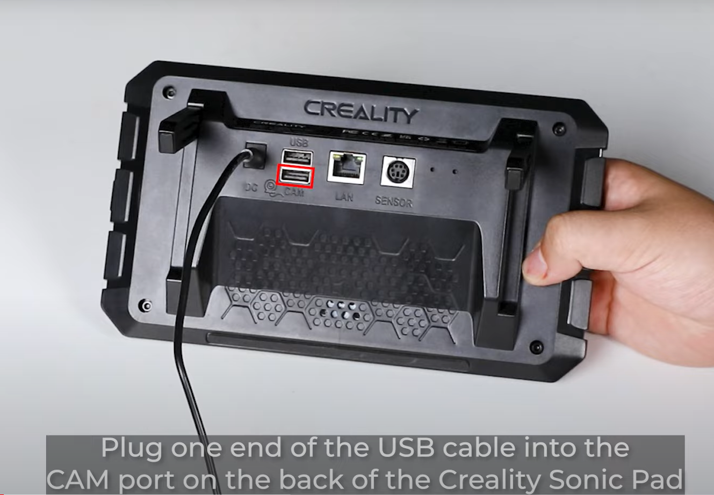
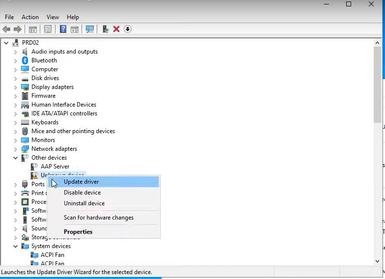
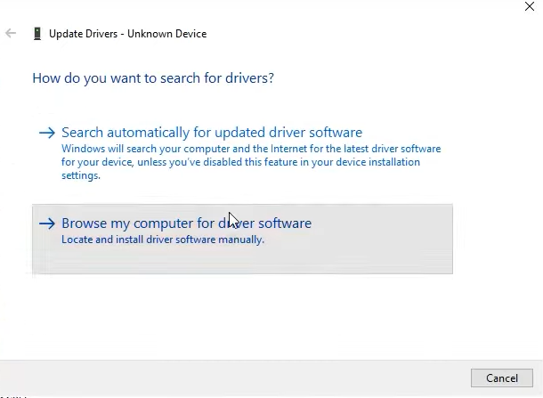
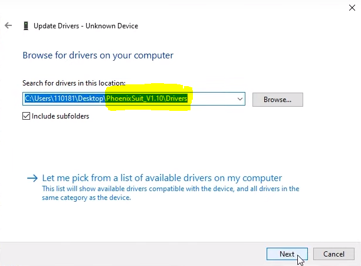
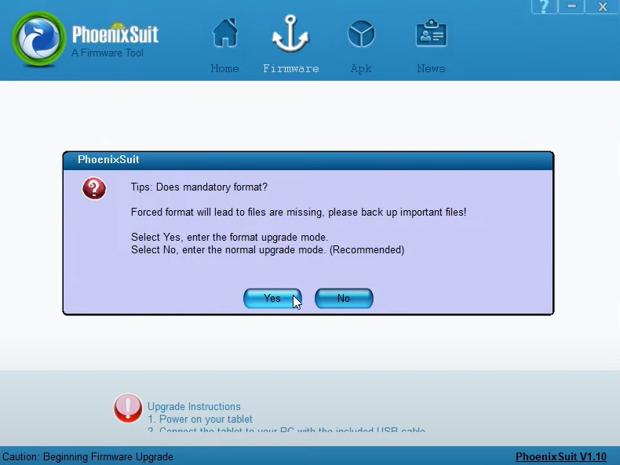
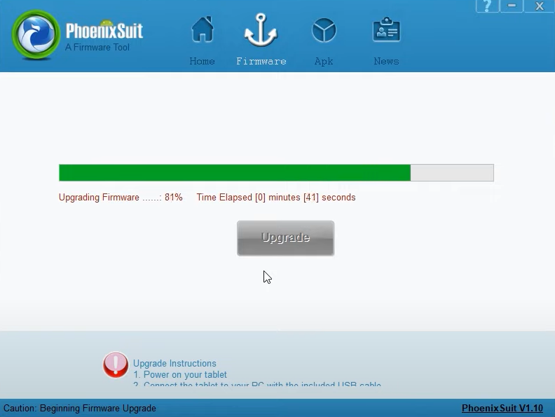
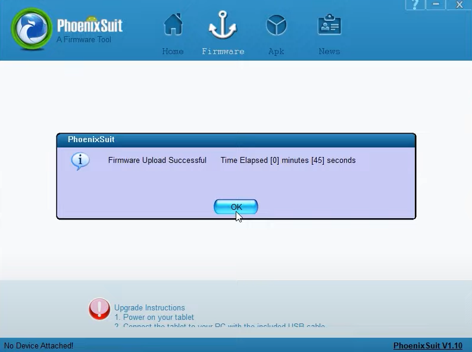
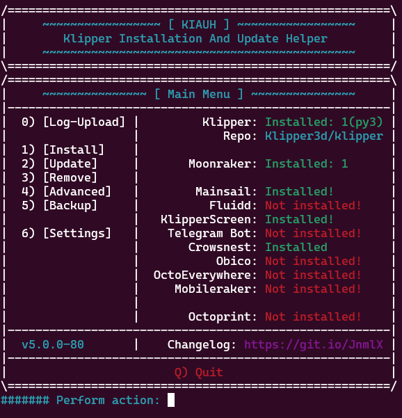

# Advanced-SonicPad
This repository aims to be a central place for information regarding advanced use cases of the Sonic Pad, with a focus on SonicPad-Debian.

**Why install SonicPad-Debian?**

The Sonic Pad runs Tina Linux, a forked version of OpenWRT made by Allwinner, the SOC manufacturer for the Sonic Pad. The Sonic Pad runs modified versions of popular open source software like Klipper, Moonraker, and Klipper Screen. This is great because it makes it "just work" for their one particular use case, but offers little in terms of customization for advanced users.

The SonicPad-Debian project is a fork of Debian Linux designed to run on the sonic pad. It comes preinstalled with mainline, unmodified 3d printing software like Klipper, Mainsail, and Klipper Screen.  

In order to install this we are going to need to download the new firmware, flash it to the sonic pad, and then do some configuration afterwards.

Be warned: This tutorial assumes some very basic knowledge of Linux, but-- if you've ever messed around with a Raspberry Pi for more than a few hours you'll be fine.

### [Need more visuals? See the 2 Minute Video Tutorial](https://www.youtube.com/watch?v=W4cSQND8eSM)

-----

Download Page links (direct download links are provided below):

[Creality OG Firmware Download](https://www.creality.com/pages/download-creality-sonic-pad) (in case you ever want to go back)

[SonicPad Debian GitHub Releases Page](https://github.com/Jpe230/SonicPad-Debian/releases)

[Creality SonicPad Firmware GitHub Page - PhoenixSuit Firmware Install Tool](https://github.com/CrealityOfficial/Creality_Sonic_Pad_Firmware)

## Download The SonicPad-Debian Firmware

Download three files from the SonicPad Debian GitHub Releases Page:
- [`debian_r818_sonic_lcd_uart0.zip`](https://github.com/Jpe230/SonicPad-Debian/releases/download/v1.0-bullseye/debian_r818_sonic_lcd_uart0.zip)
- [`debian_r818_sonic_lcd_uart0.z01`](https://github.com/Jpe230/SonicPad-Debian/releases/download/v1.0-bullseye/debian_r818_sonic_lcd_uart0.z01)
- [`debian_r818_sonic_lcd_uart0.z02`](https://github.com/Jpe230/SonicPad-Debian/releases/download/v1.0-bullseye/debian_r818_sonic_lcd_uart0.z02)

If you haven't seen it before, this is a multi part zip file. That is, the contents of the zip are spread out throughout the three files and you need all three to extract the full contents. 

Unzip the firmware, you will find a file called `t800-sonic-debian.img` (or something similar)

## Download PhoenixSuit
This subsection of the tutorial has an Official Video Tutorial from Creality, as well as official written guides for Windows, MacOS, and Ubuntu. If you are using an operating system other than Windows or need more assistance, please see:
- [`YouTube: Creality Sonic Pad System Restore Tutorial`](https://www.youtube.com/watch?v=i0iNu-1b6NI)
- [`Sonic Pad Firmware Burning Tutorial _Windows_V1.1.pdf`](https://raw.githubusercontent.com/qwazwsx/Advanced-SonicPad/main/Official%20Firmware%20Update%20Tutorials/Sonic%20Pad%20Firmware%20Burning%20Tutorial%20_Windows_V1.1.pdf)
- [`Sonic Pad Firmware Burning Tutorial_MacOS_V1.3.pdf`](https://raw.githubusercontent.com/qwazwsx/Advanced-SonicPad/main/Official%20Firmware%20Update%20Tutorials/Sonic%20Pad%20Firmware%20Burning%20Tutorial_MacOS_V1.3.pdf)
- [`Sonic Pad Firmware Burning Tutorial_Ubuntu_V1.1.pdf`](https://raw.githubusercontent.com/qwazwsx/Advanced-SonicPad/main/Official%20Firmware%20Update%20Tutorials/Sonic%20Pad%20Firmware%20Burning%20Tutorial_Ubuntu_V1.1.pdf)

Download [`PhoenixSuit_Windows_V1.10.zip`](https://github.com/CrealityOfficial/Creality_Sonic_Pad_Firmware/raw/main/tools/PhoenixSuit_Windows_V1.10.zip) from the "tools" directory in the Creality Sonic Pad Firmware GitHub page.  Unzip the file and enter the `PhoenixSuit_V1.10` directory. Open the `PhoenixSuit.exe` file. After a few moments, PhoenixSuit will open.

Navigate to the "Firmware" tab. Click "Image" and select the newly extracted `t800-sonic-debian.img` file. 

You can leave the software be for now.

## Put SonicPad in Burning Mode

Connect one end of a [**USB A Male to USB A Male**](https://www.amazon.com/s?k=usb+a+male+to+usb+a+male) cable into the bottom port labeled "CAM" on the back of the Sonic Pad. Plug the other end into your computer.

Put the Sonic Pad into "Burning Mode" by pressing and holding down the outermost recessed button with a small tool while turning the Sonic Pad on. The screen will remain black, but light on the side will still illuminate.

Next, we need to install the PhoenixSuit drivers in order to communicate with the SonicPad
## Install Drivers

Open **Device Manager**

Navigate to "Other Devices" and look for the item listed as "Unknown Device". If you want to confirm that this is indeed the Sonic Pad, disconnect the USB cable and check to see if the device listing disappears. 

**Right click the Unknown Device** and select **Update Driver**

Select **"Browse my computer for driver software"**

Select **"Browse"** and select the subdirectory "Drivers" from the Phoenix Suit zip file you downloaded earlier.

Click **Next**, the drivers will be installed, and the PhoenixSuit software should pop up. If it doesn't, try restarting the Sonic Pad and re-entering Burning Mode.  

## Flash the firmware

Once PhoenixSuit has popped up, click "Yes" to the prompt. Again, if there is no popup, try restarting both the Sonic Pad and the software.

***Warning: Once you flash the new firmware-- turning the power off without gracefully shutting down the Sonic Pad first can corrupt the filesystem. Do not use the power button on the side of the Sonic Pad without first gracefully shutting down***

If you ever need to go back to stock software,  you can [download the Creality firmware here](https://www.creality.com/pages/download-creality-sonic-pad).

The firmware should now begin to flash, **DO NOT REMOVE POWER OR USB CONNECTION**

The new firmware has now been installed! We just need to set some things up first.

Once it's done, restart the Sonic Pad, you should see the Debian logo (red swirl) while the device is booting.

## Configuring SonicPad-Debian

**Connect to WiFi**
Using the touchscreen, select **Menu > Network** and connect to your WiFi network (or use Ethernet). Take note of the internal IP address your Sonic Pad is assigned after connecting to your WiFi. 

If you don't already have an SSH client installed, install [PuTTY](https://www.chiark.greenend.org.uk/~sgtatham/putty/latest.html) or download the [distributable .exe here](https://the.earth.li/~sgtatham/putty/latest/w64/putty.exe)

**Connect to your SonicPad using SSH**

$ `ssh sonic@<your-sonic-pad-ip>`

The default password is `pad`. For security, no characters will show up when typing the password. You may have to type "yes" to confirm connecting for the first time.

**Change Default Passwords (optional but important)**
Default Users:

user: `root`, password: `toor`

user: `sonic`, password: `pad`

To change `root` user password:

$ `sudo passwd root` 

To change `sonic` user password:

$ `passwd sonic`

~~**Resize filesystem**~~

As of release v1.0, the filesystem is automatically resized at first boot, so this step is no longer required.

~~Since the image we flashed to the Sonic Pad was only 3 GB, we need to expand this 3 GB filesystem to the full 8 GB of the drive.~~

~~$ `sudo resize2fs /dev/mmcblk0p5`~~

~~You can examine the filesystem size before and after the operation using the command `df -h`~~

**Update System**
$ `sudo apt-get update && sudo apt-get upgrade`

Command Breakdown:
As root, update all package index files, and then upgrade all packages

**Install other 3D Printing Software with KIAUH**
SonicPad-Debian comes preinstalled with KIAUH the Klipper Installation And Update Helper. This will allow you to easily install or remove software like Klipper, Moonraker, Mainsail, Fluid, Crowsnest, and others. You can open KIAUH using the following command

$ `~/kiauh/kiauh.sh`

Command breakdown:
Runs the KIAUH executable located at `/home/sonic/kiauh/kiauh.sh`

Follow the onscreen instructions to install the software you want.

*Klipper* - handles talking with the printer via serial

*Mainsail* - provides an API for Klipper, so other software can talk to the printer

*Moonraker* - web frontend for printer control (install one or both)

*Fluidd* - web frontend for printer control (install one or both)

*KlipperScreen* - provides GUI for Sonic Pad screen

**Configure Software**
You should be able to configure the software you have installed by editing config files located in the  `/home/sonic/printer_data/config` directory.

If you are experiencing and problems you can view the log files located at `/home/sonic/printer_data/config`.

**DO NOT EVER PRESS THE POWER BUTTON ON THE SIDE OF THE SONIC PAD**
You must gracefully shut the Sonic Pad down using an interface like KlipperScreen or Mainsail, or by issuing the command `sudo shutdown now` or `sudo reboot`. If you don't, the filesystem may be damaged and you might have to re-flash the Sonic Pad. Let me reiterate for those skimming.

***Just like your home computer-- Turning the power off without gracefully shutting down the Sonic Pad first can corrupt the filesystem. Do not use the power button on the side of the Sonic Pad.***

***Just like your home computer-- Turning the power off without gracefully shutting down the Sonic Pad first can corrupt the filesystem. Do not use the power button on the side of the Sonic Pad.***

***Just like your home computer-- Turning the power off without gracefully shutting down the Sonic Pad first can corrupt the filesystem. Do not use the power button on the side of the Sonic Pad.***

------

## Optional (but helpful) addon steps:
- [**Add KlipperScreen to Moonraker's Update Manager**](SetupKlipperScreenUpdater.md)
	- Let Moonraker handle keeping KlipperScreen up to date 
- [**Fix System Clock Time zone**](AdjustTimeZone.md)
	- Set time zone to your proper location
- [**Install Accelerometer**](InstallAccelerometer.md)
	- Install and configure Accelerometer 
- [**Turn off display after inactivity**](EnableDisplayTimeout.md)
	- Turn off backlight when the screen goes to sleep
 - [**Add support for USB Flash Drives**](AddUSBDriveGcodeSupport.md)
 	- Adds support for USB flash drives back to KlipperScreen

